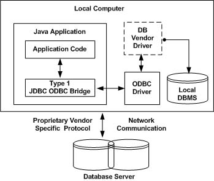
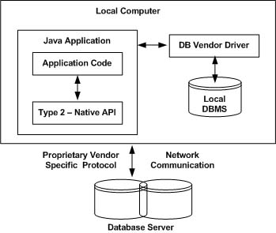
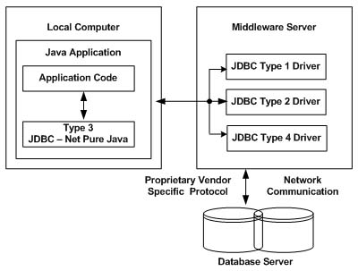
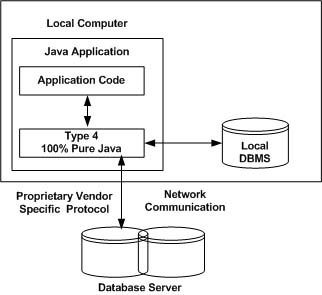

# 驱动类型

## 什么是 JDBC 驱动程序？

JDBC 驱动实现了 JDBC API 中定义的接口，该接口用于与数据库服务器进行交互。

例如，使用 JDBC 驱动程序可以让你打开数据库连接，并通过发送 SQL 或数据库命令，然后通过 Java 接收结果。

*java.sql* 包中附带的 JDK，包含了定义各种类与他们的行为和实际实现，这些类都在第三方驱动程序中完成。第三方供应商在他们的数据库驱动程序中都实现了 *java.sql.Driver* 接口。

## JDBC 驱动程序类型

JDBC 驱动程序的实现，因为各种各样的操作系统和 Java 运行在硬件平台的不同而不同。Sun 公司将实现类型分为四类：类型1，2，3，4，其解释如下-

### 类型1：JDBC-ODBC 桥驱动程序：

在类型1驱动程序中，一个 JDBC 桥接器是用来访问安装在每个客户机上的    ODBC 驱动程序。为了使用 ODBC，需要在目标数据库上配置系统数据源名称（DSN）。

当 Java 刚出来时，这是一个很有用的驱动程序，因为大多数的数据库只支持 ODBC 访问，但现在此类型的驱动程序仅适用于实验用途或在没有其他选择的情况。

自带 JDK 1.2 中的 JDBC-ODBC 桥是这类驱动程序的一个很好的例子。

### 类型2：JDBC-Native API

在类型2驱动程序中，JDBC API 调用转换成原生的 C/C++ API 调用，这对于数据库来说具有唯一性。这些驱动程序通常由数据库供应商提供，并和 JDBC-ODBC 桥驱动程序同样的方式使用。该供应商的驱动程序必须安装在每台客户机上。

如果我们改变了当前数据库，我们必须改变原生 API ，因为它是具体到某一个数据库，并且他们大多已经失效了。即使这样用类型2驱动程序也能提高一些速度，因为他消除了 ODBC 的开销。

Oracle 调用接口（OCI）驱动程序是一个类型2驱动程序的示例。

### 类型3：JDBC-Net 纯 Java 

在类型3驱动程序中，一般用三层方法来访问数据库。JDBC 客户端使用标准的网络套接字与中间件应用服务器进行通信。套接字的相关信息被中间件应用服务器转换为数据库管理系统所要求的的调用格式，并转发到数据库服务器。

这种驱动程序是非常灵活的，因为它不需要在客户端上安装代码，而且单个驱动程序能提供访问多个数据库。

你可以将应用服务器作为一个 JDBC “代理”，这意味着它会调用客户端应用程序。因此，你需要一些有关服务器配置方面的知识，这样可以高效地使用此驱动程序类型。

你的应用服务器可能使用类型1，2，或4驱动程序与数据库进行通信，了解它们的细微之处将会很有帮助。

### 类型4：100％纯 Java

在类型4驱动程序中，一个纯粹的基于 Java 的驱动程序通过 socket 连接与供应商的数据库进行通信。这是可用于数据库的最高性能的驱动程序，并且通常由供应商自身提供。

这种驱动器是非常灵活的，你不需要在客户端或服务端上安装特殊的软件。此外，这些驱动程序是可以动态下载的。

MySQL Connector/J 的驱动程序是一个类型4驱动程序。因为它们的网络协议的专有属性，数据库供应商通常提供类型4的驱动程序。

## 该使用哪种驱动程序？

如果你正在访问一个数据库，如 Oracle，Sybase 或 IBM，首选的驱动程序是类型4。

如果你的 Java 应用程序同时访问多个数据库类型，类型3是首选的驱动程序。

类型2驱动程序是在你的数据库没有提供类型3或类型4驱动程序时使用的。

类型1驱动程序不被认为是部署级的驱动程序，它存在的目的通常仅用于开发和测试。